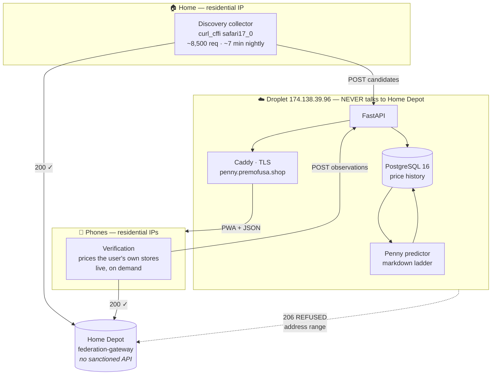

# Penny Run v2 — Architecture Design

**Date:** 2026-08-05
**Status:** Draft for review
**Scope:** Data core + new app (subsystems A and C). Penny prediction (B),
register feedback (D) and alerts (E) are named here only where they constrain
the data model.

---

## 1. The constraint everything is shaped by

Home Depot has **no sanctioned API**. No developer portal, no key, no
documentation, no versioning, no support, no promise of continued access.
What exists is `apionline.homedepot.com/federation-gateway/graphql` — the
internal gateway that powers homedepot.com and their mobile app. We call it
the way their own website does.

Access is guarded by **two independent checks**, both measured on 2026-08-05
with identical code run minutes apart:

| client | from residential (Comcast) | from the droplet (DigitalOcean) |
|---|---|---|
| `urllib` / plain `curl` | **206 refused** | **206 refused** |
| `curl_cffi` `impersonate="safari17_0"` | **200 — 4/4 with data** | **206 refused — 0/4** |

Conclusions, all load-bearing:

1. **A browser-grade TLS/HTTP2 fingerprint is required.** Python's `urllib`
   never had one. This is why the existing sweep broke mid-day on 2026-08-05 —
   Home Depot tightened the check, not the address rules.
2. **Datacentre address ranges are refused regardless of fingerprint.** Six
   impersonation profiles were tried from the droplet; all six refused. IPv6
   has no route out. **The droplet can never collect from Home Depot.** This is
   not fixable in software.
3. **CORS remains fully open.** `access-control-allow-origin: *`, preflight
   `OPTIONS` returns 200, and a `POST` carrying `Origin: https://penny.premofusa.shop`
   returns real clearance data. A browser on any origin can query them directly.
4. **Access changes without warning.** It changed inside one working day.

A fifth fact from the existing data set (3,000 shipped rows):

5. **The API never quotes a penny price.** Zero rows at $0.01; the floor is
   $0.10. Penny status is only ever confirmed at the register. Finding penny
   items can therefore never be a query — it must be a **prediction over price
   history**, and history is precisely what the current system does not keep.

**Design consequence:** Postgres on the droplet is the system of record, not
Home Depot. Once observed, a price is ours. If access is cut tomorrow the
product degrades; it does not die.

### Legal note

This is scraping a retailer's site and is very likely contrary to their terms
of service. Access may be revoked deliberately. This is an accepted business
risk, recorded here so it is not a surprise later.

---

## 2. Topology

Three tiers, split by **who is allowed to talk to Home Depot**.



| tier | job | why there |
|---|---|---|
| **Home box** (Mac, later a Pi) | Discovery — walk the sitemap, find what is marked down anywhere | Needs a residential IP and sustained volume |
| **Phones** | Verification — price items at the user's own stores | Residential IPs, real-time, the user wants the answer anyway |
| **Droplet** | Postgres, API, PWA, prediction, aggregation | None of it requires Home Depot access |

Phones are excellent at verification and poor at discovery: discovery needs
volume across products nobody is looking at, which is somebody's battery and
cellular data spent on items they will never see. Discovery stays on one home
box; verification is crowd-sourced and grows with the userbase.

---

## 3. Data model

PostgreSQL 16, database `pennyrun`, role `pennyrun`, bound to localhost.
Credential at `/root/.pennyrun-db.env` (0600).

```sql
-- Catalogue facts. Store-independent, slow-changing.
product (
  item_id        text primary key,
  name           text not null,
  category       text,
  upc            text,
  store_sku      text,
  model_number   text,
  canonical_url  text,
  replacement_id text,              -- info.replacementOMSID, ~10x richer among clearance
  first_seen     date not null,
  last_seen      date not null
)
create index on product (upc);

-- All 2,021 US stores, seeded from the existing hd-stores.json.
store (
  store_id  text primary key,
  name      text, street text, city text, state text, zip text,
  lat       double precision, lon double precision
)
create index on store (zip);
create index on store (lat, lon);

-- THE CORE TABLE. Append-only. One row per price seen, ever.
observation (
  id              bigserial primary key,
  item_id         text not null references product,
  store_id        text not null references store,
  observed_at     timestamptz not null default now(),
  list_price      numeric(10,2),
  clearance_price numeric(10,2),
  pct_off         numeric(5,2),
  quantity        integer,          -- anchor location only
  store_only      boolean,
  source          text not null,    -- 'discovery' | 'phone' | 'confirmation'
  device_id       uuid references device,
  trusted         boolean not null default false
)
create index on observation (item_id, store_id, observed_at desc);
create index on observation (store_id, observed_at desc) where clearance_price is not null;
create unique index on observation (item_id, store_id, observed_at);

-- Derived rollup: what is believed marked down right now, and where.
candidate (
  item_id       text primary key references product,
  first_marked  date not null,
  last_marked   date not null,
  best_pct_off  numeric(5,2),
  store_count   integer,            -- how many stores have shown it marked down
  penny_score   numeric(5,2),       -- see §4
  updated_at    timestamptz not null default now()
)
create index on candidate (penny_score desc, last_marked desc);

-- Anonymous identity. No accounts, no passwords, no email.
device (
  device_id     uuid primary key,
  created_at    timestamptz not null default now(),
  last_seen     timestamptz,
  trust_score   numeric(4,2) not null default 0.5,
  transfer_code text unique         -- lets a user move state to a new phone
)

-- Which stores a device cares about. Drives demand-driven coverage.
device_store (
  device_id uuid references device,
  store_id  text references store,
  primary key (device_id, store_id)
)

-- Register truth. The only real proof, and the training label for §4.
confirmation (
  id          bigserial primary key,
  item_id     text not null references product,
  store_id    text not null references store,
  device_id   uuid references device,
  scanned_price numeric(10,2) not null,
  is_penny    boolean generated always as (scanned_price <= 0.01) stored,
  confirmed_at timestamptz not null default now()
)
```

**Why append-only matters.** The current system's worst failure is a collapsed
sweep overwriting a good list — hence the 40%/60% safety rails. With an
append-only observation log that failure becomes structurally impossible: a bad
run writes fewer rows, it cannot destroy earlier ones. The rails move from
"refuse to write" to "flag the run as suspect."

**Volume.** Current shape is ~6,500 observations/night (811 distinct items × 8
stores), or ~2.4M rows/year. Trivial for Postgres on 63 GB free. Revisit
monthly partitioning past ~50M rows; not now.

---

## 4. Penny prediction — the markdown ladder

The API cannot be asked "is this a penny item." The signal is **trajectory**:
markdowns cascade, and an item stepping down its ladder is on its way to the
bottom. A snapshot cannot show a step; two observations can.

`penny_score` is stored **per item** on `candidate` — the best score across all
stores where the item has been seen — and recomputed nightly from `observation`.
A **per-store** score is derived at query time from that store's own observation
history, because the same item can be three rungs down the ladder at one store
and untouched at another. The stored score drives the national candidate list;
the derived score drives `GET /store/{id}/clearance`.

Inputs, applied identically in both cases:

| input | weight | rationale |
|---|---|---|
| number of distinct price drops | +2 each | the ladder itself; the strongest available signal |
| current pct_off ≥ 90 | +2 | near the floor |
| price dropped within last 48h | +2 | markdowns cascade; a moving price is still moving |
| has `replacement_id` | +1 | measured ~10× richer among clearance items |
| quantity ≤ 2 at the anchor store | +1 | last of the pallet |
| `store_only` | 0 | **measured backwards** — 14% among clearance vs 22% overall. Displayed, never scored |
| flat price ≥ 21 days | −2 | a stable markdown is a promotion, not a cascade |

Weights are a **starting heuristic, explicitly not tuned** — `confirmation` rows
accumulate the ground truth needed to fit them properly later (subsystem B).
Every score ships with the clue list that produced it, so the app can explain
itself and the user can disagree.

The app's existing shelf-side clue scoring (`CLUES`, `ENDING_SCORE`) is
retained unchanged and shown alongside. Two independent opinions — one from
history, one from the tag in front of you.

---

## 5. API

FastAPI + uvicorn on localhost, Caddy terminating TLS in front. JSON only,
versioned under `/api/v1`. Anonymous device identity via `X-Device-Id` header.

### Read

| endpoint | purpose |
|---|---|
| `GET /api/v1/stores?zip=&lat=&lon=` | store lookup, served from `store` |
| `GET /api/v1/store/{id}/clearance?limit=&min_pct=` | **"what's on clearance at my store"** — the browse view |
| `GET /api/v1/item/{item_id}?stores=a,b,c` | **cross-store compare** — last known price per store, each row carrying `observed_at` so staleness is visible |
| `GET /api/v1/lookup?upc=` | barcode → item, answers a scan offline-first |
| `GET /api/v1/candidates?since=` | national candidate list, deduplicated by item |
| `GET /api/v1/work?n=25` | optional verification queue for an idle phone |

Cross-store compare is deliberately cheap: it returns **cached** prices
instantly, and the app fires live per-store queries in parallel to refresh
them. One item at ten stores is ten requests from the phone, sub-second, and
costs the droplet nothing.

### Write

| endpoint | purpose |
|---|---|
| `POST /api/v1/observations` | phone submits prices it fetched |
| `POST /api/v1/confirmations` | register result — the ground truth |
| `PUT /api/v1/device/stores` | set the device's stores |
| `POST /api/v1/device/transfer` | claim state on a new phone via transfer code |
| `POST /api/v1/discovery` | home collector bulk-uploads a run (bearer token) |

---

## 6. Trust — because clients submit data

Anyone can POST to the ingest endpoint. Untreated, the list is poisonable.

1. **Bounds.** Reject `clearance_price > list_price`, `pct_off` outside 0–100,
   prices below $0.01 or above $100,000, unknown `item_id`/`store_id`.
2. **Rate limits.** Per device, per hour. A phone verifying its own stores needs
   tens of writes; thousands is abuse.
3. **Corroboration.** A phone observation lands `trusted=false` and does not move
   the public list until either a second independent device agrees, or the home
   collector re-checks it. Discovery-sourced rows are trusted on arrival.
4. **Spot re-verification.** The nightly discovery run re-prices a random sample
   of recent phone submissions. Disagreement lowers that device's `trust_score`.
5. **Trust decay.** Devices below a threshold keep working locally but stop
   contributing.

Confirmations are treated as high-value and rate-limited hardest — they are the
training labels, and poisoning them corrupts prediction permanently.

---

## 7. The app

Redesigned PWA, still served as static files from the droplet, still
offline-first. It is a web app because iOS gives the camera only to a secure web
context and Python cannot run in a phone browser.

**Removed**
- The entire iOS Shortcut path — regex block, `?text=`/`?url=` share handling,
  `parseHDShare`, the copy-paste instruction pane. Roughly 80 lines of UI that
  existed only because there was no backend. Confirmed for removal.
- `clearance.json` as a shipped 772 KB file. Replaced by API queries.
- `localStorage` as the system of record; it becomes a cache.

**Retained**
- zxing barcode scanning and tesseract tag OCR, both bundled and offline.
- The clue-scoring verdict sheet and its weights.
- Service-worker offline behaviour, which was already correct.

**Added**
- Store picker backed by `/stores`, persisted server-side per device.
- **Cross-store compare** — one item, every nearby store, live.
- **Store browse** — what is on clearance at a chosen store, sorted by
  `penny_score`.
- Register confirmation flow feeding `POST /confirmations`.
- Price history sparkline per item — the ladder, made visible.

**State moves server-side**, keyed by `device_id`. This is deliberate: a domain
change is planned (a dedicated pennyrun domain once this proves out), and
`localStorage` is origin-scoped, so today every saved item would be lost in that
move. Server-side state makes it a non-event.

Visual direction is not specified here — it is a separate concern from
architecture and will be settled against the existing design language in
`docs/how-it-works.html`.

---

## 8. Serving

```
Caddy :443  penny.premofusa.shop   (auto TLS, DNS already propagated)
  /api/*        → reverse_proxy 127.0.0.1:8000   (uvicorn, systemd)
  /*            → static PWA, no-cache on shell, long cache on assets
PostgreSQL 16   → 127.0.0.1:5432 only
ufw             → 22, 80, 443
swap            → 2 GB (1.9 GB RAM box)
```

Already provisioned: Postgres, database, role, swap, firewall, DNS.

---

## 9. Failure modes

| failure | detection | behaviour |
|---|---|---|
| Home Depot changes the fingerprint check again | discovery probe distinguishes **transport error** from **refusal** | run marked failed, alert, yesterday's data still serves |
| Discovery box offline | no successful run in 36h | banner in app: "prices last updated X ago" |
| Collapsed run (few rows) | row count vs trailing median | run flagged suspect, rows land untrusted; nothing is destroyed — the log is append-only |
| CORS closed by Home Depot | phone verification returns network errors | phones stop contributing; browse still works from stored history |
| Poisoned submissions | corroboration + spot re-verify | untrusted rows never reach the public list |

**`checkhost.py` must be fixed first.** It currently reports *every* exception as
`BLOCKED` — an SSL certificate failure on this Mac produced a confident
"Home Depot will not quote prices to this address range," which is exactly the
swallowed-error failure the existing docs warn about, reproduced inside the tool
written to detect it. Transport failure and refusal must be distinguishable.

---

## 10. Explicitly not building

- Accounts, passwords, email. Anonymous `device_id` + transfer code.
- Push notifications (subsystem E).
- A precomputed national price matrix — 4.2M products × 2,021 stores is 8.5
  billion queries, ~298 days per pass at measured throughput. Coverage is
  demand-driven: stores get priced because someone selected them.
- Managed Postgres. ~$15/mo for a workload measured in single-digit millions of
  rows, plus network latency a local socket does not have.
- Residential proxies. Held in reserve; only needed if discovery must move to
  the droplet.
- Headless Chromium collection. CPU- and RAM-bound on a 1 vCPU / 1.9 GB box, and
  unnecessary now that impersonation is proven.

---

## 11. Build order

1. **Fix the collector** — swap `urllib` for `curl_cffi` (`safari17_0`) in
   `sweep.py`. Restores the pipeline immediately, from home. Independent of
   everything else.
2. **Fix `checkhost.py`** — separate transport failure from refusal.
3. **Schema + migrations**, seed `store` from `hd-stores.json` and `product`
   from existing `clearance.json`.
4. **Discovery uploads to the API** instead of writing a JSON file.
5. **Read API** + Caddy + TLS. App still on old data at this point.
6. **App rewrite** against the API; Shortcut removed.
7. **Phone verification** — observations, trust rules, corroboration.
8. **Penny score** computed nightly and surfaced.

Steps 1–2 are worth doing tonight regardless of when the rest lands: history
accrues in wall-clock time and cannot be backfilled.

---

## 12. Open decision

**Anonymous device IDs are specified above.** If accounts are wanted later
(needed for alerts across devices, subsystem E), the `device` table gains a
nullable `user_id` and nothing else changes. Flagged because it is the one
choice here that is cheaper to make now than to retrofit.
